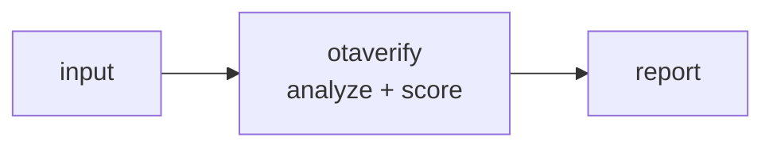

<a name="top"></a>
<div align="center">


# OTAVERIFY

### Validate OTA update packages end-to-end: signature chains, rollback protection, anti-downgrade counters, and delta-patch integrity.


[](https://pypi.org/project/cognis-otaverify/) [](https://github.com/cognis-digital/otaverify/actions) [](LICENSE) [](https://github.com/cognis-digital)

*IoT / OT / Embedded — firmware, buses, and device security.*

</div>

```bash
pip install cognis-otaverify
otaverify scan .            # → prioritized findings in seconds
```

## Usage — step by step

`otaverify` validates OTA update packages — signature chains, anti-downgrade
counters, expiry and payload digests (TUF/Uptane spirit). Console script: `otaverify`.

1. **Install** from a clone:
   ```bash
   pip install -e .
   ```
2. **Verify a package** — exits non-zero if the package would be rejected (CI gate):
   ```bash
   otaverify verify demos/01-basic/package.json
   ```
3. **Read the verdict programmatically** with JSON output:
   ```bash
   otaverify --format json verify package.json | jq '.ok, .summary'
   ```
   `ok: false` means REJECT; the `findings` array explains why.
   For code-scanning dashboards, emit **SARIF 2.1.0**:
   ```bash
   otaverify --format sarif verify package.json > otaverify.sarif
   ```
   (`--format` is a global flag — place it before the `verify` subcommand.)
4. **Inspect findings** — each finding carries a `check`, `severity` (error/warning/info) and `message`.
5. **Automate in CI** — block shipping an unsafe update:
   ```yaml
   - run: pip install -e .
   - run: otaverify verify release/package.json
   ```

## Contents

- [Why otaverify?](#why) · [Features](#features) · [Quick start](#quick-start) · [Example](#example) · [Demos](#demos) · [Architecture](#architecture) · [AI stack](#ai-stack) · [How it compares](#how-it-compares) · [Integrations](#integrations) · [Install anywhere](#install-anywhere) · [Related](#related) · [Contributing](#contributing)

<a name="why"></a>
## Why otaverify?

Uptane/automotive OTA compliance hook — one command in your release pipeline that blocks shipping an unsigned or downgradeable update. Ties directly to UN R155/R156 cyber regs.

`otaverify` is single-purpose, scriptable, and self-hostable: point it at a target, get prioritized results in the format your workflow already speaks (table · JSON · SARIF), gate CI on it, and let agents drive it over MCP.

<div align="right"><a href="#top">↑ back to top</a></div>

<a name="features"></a>
## Features

- ✅ Load Json
- ✅ Canonical Bytes
- ✅ Verify Manifest
- ✅ Check Anti Downgrade
- ✅ Check Payloads
- ✅ Verify Package
- ✅ Table · JSON · **SARIF 2.1.0** output (GitHub code-scanning ready)
- ✅ 8 worked demo scenarios in [`demos/`](demos/) (accept + every reject class)
- ✅ Runs on Linux/macOS/Windows · Docker · devcontainer
- ✅ Ports in Python, JavaScript, Go, and Rust (`ports/`)

<div align="right"><a href="#top">↑ back to top</a></div>

<a name="quick-start"></a>
## Quick start

```bash
pip install cognis-otaverify
otaverify --version
otaverify scan .                       # scan current project
otaverify scan . --format json         # machine-readable
otaverify scan . --fail-on high        # CI gate (non-zero exit)
```

<div align="right"><a href="#top">↑ back to top</a></div>

<a name="example"></a>
## Example

```text
$ otaverify scan .
  [HIGH    ] OTA-001  example finding             (./src/app.py)
  [MEDIUM  ] OTA-002  another signal              (./config.yaml)

  2 findings · risk score 5 · 38ms
```

<div align="right"><a href="#top">↑ back to top</a></div>

<a name="demos"></a>
## Demos — worked OTA scenarios

Each folder under [`demos/`](demos/) is a self-contained package in otaverify's
real input format with a `SCENARIO.md` (provenance, the exact run command, and
how to act on the verdict). All packages carry **valid precomputed HMAC
signatures** and are exercised by the test suite, so every one fires as
documented.

| Demo | Scenario | Verdict |
|---|---|:---:|
| [`01-basic`](demos/01-basic/) | Two-key 2-of-2 forward upgrade with payload digest | ACCEPT* |
| [`04-automotive-ecu`](demos/04-automotive-ecu/) | UN R155/R156 ECU fleet bump, 2-of-3 quorum | ACCEPT |
| [`05-expired-manifest`](demos/05-expired-manifest/) | Valid but stale staging artifact (freshness) | REJECT |
| [`06-downgrade-blocked`](demos/06-downgrade-blocked/) | Signed rollback attack to vulnerable firmware | REJECT |
| [`07-payload-tampered`](demos/07-payload-tampered/) | Authentic manifest, mismatched payload bytes | REJECT |
| [`08-threshold-not-met`](demos/08-threshold-not-met/) | HSM unavailable, only 1 of 2 signers | REJECT |
| [`09-unknown-key`](demos/09-unknown-key/) | Supply-chain inject signed by a rogue key | REJECT |
| [`10-router-multi-image`](demos/10-router-multi-image/) | 3-of-3 multi-image bundle, fully verified | ACCEPT |

```bash
python -m otaverify verify demos/06-downgrade-blocked/package.json   # REJECT, exit 1
python -m otaverify --format sarif verify demos/10-router-multi-image/package.json
```

<sub>* `01-basic` ships a human-readable placeholder signature; re-sign with the
stdlib (see its `SCENARIO.md`) to make it ACCEPT.</sub>

<div align="right"><a href="#top">↑ back to top</a></div>

<a name="architecture"></a>
## Architecture



<div align="right"><a href="#top">↑ back to top</a></div>

<a name="ai-stack"></a>
## Use it from any AI stack

`otaverify` is interoperable with every popular way of using AI:

- **MCP server** — `otaverify mcp` (Claude Desktop, Cursor, Cognis.Studio, [uncensored-fleet](https://github.com/cognis-digital/uncensored-fleet))
- **OpenAI-compatible / JSON** — pipe `otaverify scan . --format json` into any agent or LLM
- **LangChain · CrewAI · AutoGen · LlamaIndex** — wrap the CLI/JSON as a tool in one line
- **CI / scripts** — exit codes + SARIF for non-AI pipelines

<div align="right"><a href="#top">↑ back to top</a></div>

<a name="how-it-compares"></a>
## How it compares

| | **Cognis otaverify** | TUF |
|---|:---:|:---:|
| Self-hostable, no account | ✅ | varies |
| Single command, zero config | ✅ | ⚠️ |
| JSON + SARIF for CI | ✅ | varies |
| MCP-native (AI agents) | ✅ | ❌ |
| Polyglot ports (JS/Go/Rust) | ✅ | ❌ |
| Open license | ✅ COCL | varies |

*Built in the spirit of **TUF / Uptane + Mender**, re-framed the Cognis way. Missing a credit? Open a PR.*

<div align="right"><a href="#top">↑ back to top</a></div>

<a name="integrations"></a>
## Integrations

Pipes into your stack: **SARIF** for code-scanning, **JSON** for anything, an **MCP server** (`otaverify mcp`) for AI agents, and a webhook forwarder for SIEM/Slack/Jira. See [`docs/INTEGRATIONS.md`](docs/INTEGRATIONS.md).

<div align="right"><a href="#top">↑ back to top</a></div>

<a name="install-anywhere"></a>
## Install — every way, every platform

```bash
pip install "git+https://github.com/cognis-digital/otaverify.git"    # pip (works today)
pipx install "git+https://github.com/cognis-digital/otaverify.git"   # isolated CLI
uv tool install "git+https://github.com/cognis-digital/otaverify.git" # uv
pip install cognis-otaverify                                          # PyPI (when published)
docker run --rm ghcr.io/cognis-digital/otaverify:latest --help        # Docker
brew install cognis-digital/tap/otaverify                             # Homebrew tap
curl -fsSL https://raw.githubusercontent.com/cognis-digital/otaverify/main/install.sh | sh
```

| Linux | macOS | Windows | Docker | Cloud |
|---|---|---|---|---|
| `scripts/setup-linux.sh` | `scripts/setup-macos.sh` | `scripts/setup-windows.ps1` | `docker run ghcr.io/cognis-digital/otaverify` | [DEPLOY.md](docs/DEPLOY.md) (AWS/Azure/GCP/k8s) |

<div align="right"><a href="#top">↑ back to top</a></div>

<a name="related"></a>
## Related Cognis tools

- [`fwxray`](https://github.com/cognis-digital/fwxray) — Diff two firmware images and surface exactly what changed: new binaries, flipped config flags, added certs, and shifted entropy regions.
- [`canzap`](https://github.com/cognis-digital/canzap) — Replay, fuzz, and assert on CAN bus traffic from a .pcap or SocketCAN interface with a tiny YAML DSL.
- [`sbomb`](https://github.com/cognis-digital/sbomb) — Generate a CycloneDX SBOM directly from an unpacked firmware root filesystem and flag components with known CVEs and EOL kernels.
- [`mqttspy`](https://github.com/cognis-digital/mqttspy) — Passively map an MQTT broker: enumerate topics, detect unauthenticated writes, spot PII/secrets in payloads, and emit a risk report.
- [`uefiscan`](https://github.com/cognis-digital/uefiscan) — Audit UEFI firmware dumps for missing Secure Boot keys, unsigned modules, S3 boot-script vulns, and known SMM threats.
- [`modpot`](https://github.com/cognis-digital/modpot) — Spin up a high-interaction Modbus/DNP3 ICS honeypot that logs attacker register reads/writes as structured JSON.

**Explore the suite →** [🗂️ all 170+ tools](https://github.com/cognis-digital/cognis-neural-suite) · [⭐ awesome-cognis](https://github.com/cognis-digital/awesome-cognis) · [🔗 cognis-sources](https://github.com/cognis-digital/cognis-sources) · [🤖 uncensored-fleet](https://github.com/cognis-digital/uncensored-fleet) · [🧠 engram](https://github.com/cognis-digital/engram)

<div align="right"><a href="#top">↑ back to top</a></div>

<a name="contributing"></a>
## Contributing

PRs, new rules, and demo scenarios are welcome under the collaboration-pull model — see [CONTRIBUTING.md](CONTRIBUTING.md) and [SECURITY.md](SECURITY.md).

> ### ⭐ If `otaverify` saved you time, **star it** — it genuinely helps others find it.

## Interoperability

`{}` composes with the 300+ tool Cognis suite — JSON in/out and a shared
OpenAI-compatible `/v1` backbone. See **[INTEROP.md](INTEROP.md)** for the
suite map, composition patterns, and reference stacks.

## License

Source-available under the **Cognis Open Collaboration License (COCL) v1.0** — free for personal, internal-evaluation, research, and educational use; **commercial / production use requires a license** (licensing@cognis.digital). See [LICENSE](LICENSE).

---

<div align="center"><sub><b><a href="https://cognis.digital">Cognis Digital</a></b> · one of 170+ tools in the <a href="https://github.com/cognis-digital/cognis-neural-suite">Cognis Neural Suite</a> · <i>Making Tomorrow Better Today</i></sub></div>
