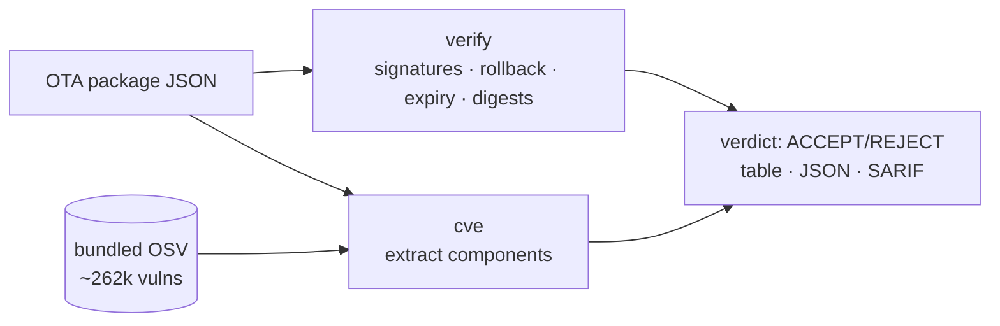

<a name="top"></a>
<div align="center">


# OTAVERIFY

### Validate OTA update packages end-to-end: signature chains, rollback protection, anti-downgrade counters, and delta-patch integrity.


[](https://pypi.org/project/cognis-otaverify/) [](https://github.com/cognis-digital/otaverify/actions) [](LICENSE) [](https://github.com/cognis-digital)

*IoT / OT / Embedded — firmware, buses, and device security.*

</div>

```bash
pip install cognis-otaverify
otaverify verify package.json        # ACCEPT / REJECT in milliseconds, exit-coded for CI
otaverify cve    package.json        # offline CVE check of bundled components
```

`otaverify` is a **passive, offline** OTA-update verifier. It reads a JSON
*package* document (trust root + signed manifest + signatures + optional payload
bytes) and answers one question: **is this update safe to flash?** It performs
no network I/O and does no active scanning — it inspects only the document you
hand it. See [Scope & safety](#scope) below.

## Usage — step by step

`otaverify` validates OTA update packages — signature chains, anti-downgrade
counters, expiry, payload digests (TUF/Uptane spirit), **and** the known-CVE
status of the components shipped inside the payload. Console script: `otaverify`.

1. **Install** from a clone:
   ```bash
   pip install -e .
   ```
2. **Verify a package** — exits non-zero if the package would be rejected (CI gate):
   ```bash
   otaverify verify demos/04-automotive-ecu/package.json
   ```
3. **Read the verdict programmatically** with JSON output:
   ```bash
   otaverify --format json verify package.json | jq '.ok, .summary'
   ```
   `ok: false` means REJECT; the `findings` array explains why.
   For code-scanning dashboards, emit **SARIF 2.1.0**:
   ```bash
   otaverify --format sarif verify package.json > otaverify.sarif
   ```
   (`--format` is a global flag — place it before the `verify`/`cve` subcommand.)
4. **Check components for known CVEs** — offline, against the bundled ~262k-record
   OSV corpus (no network):
   ```bash
   otaverify cve package.json                      # report every known vuln, exit 1 if any
   otaverify cve package.json --fail-on critical   # gate only on critical findings
   otaverify --format sarif cve package.json > cve.sarif
   ```
5. **Inspect findings** — each finding carries a `check`, `severity` (error/warning/info) and `message`.
6. **Automate in CI** — block shipping an unsafe or vulnerable update:
   ```yaml
   - run: pip install -e .
   - run: otaverify verify release/package.json          # crypto + rollback gate
   - run: otaverify cve release/package.json --fail-on high   # known-CVE gate
   ```

## Contents

- [Why otaverify?](#why) · [Features](#features) · [Quick start](#quick-start) · [Example](#example) · [Component CVE check](#cve) · [Edge / air-gap](#edge) · [Scope & safety](#scope) · [Demos](#demos) · [Architecture](#architecture) · [Ports](#ports) · [AI stack](#ai-stack) · [How it compares](#how-it-compares) · [Integrations](#integrations) · [Install anywhere](#install-anywhere) · [Related](#related) · [Contributing](#contributing)

<a name="why"></a>
## Why otaverify?

Uptane/automotive OTA compliance hook — one command in your release pipeline that blocks shipping an unsigned or downgradeable update. Ties directly to UN R155/R156 cyber regs.

`otaverify` is single-purpose, scriptable, and self-hostable: point it at a target, get prioritized results in the format your workflow already speaks (table · JSON · SARIF), gate CI on it, and let agents drive it over MCP.

<div align="right"><a href="#top">↑ back to top</a></div>

<a name="features"></a>
## Features

- ✅ **Signature quorum** — M-of-N HMAC-SHA256 over a canonical (sorted-key,
  compact) manifest encoding; unknown/duplicate signers handled explicitly
- ✅ **Anti-rollback** — blocks version downgrades *and* monotonic-counter regressions
- ✅ **Freshness** — manifest expiry (ISO-8601, `Z`-tolerant) enforced
- ✅ **Payload integrity** — per-image SHA-256 digest + size check of the actual bytes
- ✅ **Offline component CVE check** — matches components in the payload against a
  **bundled ~262k-record OSV corpus** (PyPI/npm/Go/Maven/RubyGems/crates.io/NuGet);
  CVSS v3.1 base-score severity buckets; **fully air-gapped, no network**
- ✅ **CVE-2021-44228 (Log4Shell) and friends resolve from the bundle** the moment you clone
- ✅ Table · JSON · **SARIF 2.1.0** output for both `verify` and `cve` (GitHub code-scanning ready)
- ✅ Exit-coded for CI: `0` ACCEPT / clean, `1` REJECT / vulnerable
- ✅ 10 worked demo scenarios in [`demos/`](demos/) (accept + every reject class + CVE)
- ✅ Runs on Linux/macOS/Windows · Docker · devcontainer · stdlib only
- ✅ Cross-verifying ports in Python, **JavaScript, Go, Rust, and POSIX shell** (`ports/`)
- ✅ Edge/air-gap feed refresh from NVD/OSV/GHSA with sneakernet snapshots

<div align="right"><a href="#top">↑ back to top</a></div>

<a name="quick-start"></a>
## Quick start

```bash
pip install cognis-otaverify
otaverify --version
otaverify verify package.json                  # ACCEPT/REJECT (signatures + rollback + digests)
otaverify --format json verify package.json    # machine-readable verdict
otaverify cve package.json --fail-on high       # CI gate on known-CVE components
```

<div align="right"><a href="#top">↑ back to top</a></div>

<a name="example"></a>
## Example

Verifying a signed rollback attack (demo `06-downgrade-blocked`) — perfectly
signed, but it tries to push *older* firmware onto the device:

```text
$ otaverify verify demos/06-downgrade-blocked/package.json
OTA package: demos/06-downgrade-blocked/package.json
Verdict    : REJECT
Manifest   : version=31 counter=90 errors=2 warnings=0

  [FAIL] rollback.version   downgrade blocked: update version 31 < installed 44
  [FAIL] rollback.counter   anti-rollback counter regressed: 90 < 102
  [  ok] sig.threshold      signature threshold met: 2/2 valid
  [  ok] payload.digest     payload 'rootfs' digest ok
$ echo $?
1
```

A clean automotive ECU update (demo `04-automotive-ecu`) accepts:

```text
$ otaverify verify demos/04-automotive-ecu/package.json
Verdict    : ACCEPT
  [  ok] sig.threshold   signature threshold met: 2/3 valid
  [  ok] payload.digest  payload 'ecu-app' digest ok
  [  ok] payload.digest  payload 'ecu-cfg' digest ok
```

<div align="right"><a href="#top">↑ back to top</a></div>

<a name="cve"></a>
## Component CVE check (offline)

A cryptographically perfect OTA update can still ship exploitable software. The
`cve` subcommand extracts the components from the package and matches them
against the **bundled offline OSV corpus** — no network, air-gap safe.

Components are read (in precedence order) from `components[]`, then
`manifest.images[].components`, then image names as a fallback:

```jsonc
{
  "components": [
    { "name": "log4j-core", "version": "2.14.1", "ecosystem": "Maven" },
    { "name": "lodash",     "version": "4.17.15", "ecosystem": "npm" }
  ]
}
```

```text
$ otaverify cve demos/11-vulnerable-components/package.json --min-severity high
OTA package: demos/11-vulnerable-components/package.json
Components  : 3 scanned, 3 vulnerable, 17 known vulnerabilities
Max severity: CRITICAL

  [CRITICAL] log4j-core@2.14.1  GHSA-jfh8-c2jp-5v3q (CVE-2021-44228)  Remote code injection in Log4j
  [CRITICAL] log4j-core@2.14.1  GHSA-7rjr-3q55-vv33 (CVE-2021-45046)  Incomplete fix for Apache Log4j vulnerability
  [CRITICAL] lodash@4.17.15     GHSA-jf85-cpcp-j695 (CVE-2019-10744)  Prototype Pollution in lodash
  ...
$ echo $?
1
```

Severity buckets come from each record's CVSS v3.1 vector (the official
FIRST.org base-score formula, computed in-tree — no CVSS library). Gate your
pipeline with `--fail-on {low,medium,high,critical}`; without it, the command
fails on *any* known vulnerability. The bundle ships in
[`otaverify/cognis_vulndb.jsonl.gz`](otaverify/) and is queried lazily.

<div align="right"><a href="#top">↑ back to top</a></div>

<a name="edge"></a>
## Edge / air-gap

`otaverify` is built to run on disconnected, military, or embedded gear:

- **Zero network at verify time.** Both `verify` and `cve` are pure-stdlib and
  touch no host. The 262k-record vuln corpus is bundled in the wheel/clone.
- **Refresh the corpus when you *do* have a link.** [`otaverify/datafeeds.py`](otaverify/)
  pulls the canonical, keyless feeds — **OSV, NVD CVE 2.0, GitHub GHSA, CISA KEV,
  EPSS** — caches them to disk, and re-serves them offline:
  ```bash
  python -m otaverify.datafeeds list --domain vuln
  python -m otaverify.datafeeds update osv cisa-kev epss        # fetch + cache
  python -m otaverify.datafeeds bulk nvd-cve --max 250000       # paginate NVD to disk
  ```
- **Sneakernet into an enclave.** Snapshot the cache on a connected host and
  import it across an air gap:
  ```bash
  python -m otaverify.datafeeds snapshot-export feeds.tar.gz    # on the connected side
  python -m otaverify.datafeeds snapshot-import feeds.tar.gz    # inside the air gap
  ```
  Point the cache anywhere with `COGNIS_FEEDS_CACHE=/media/usb/feeds`.

<div align="right"><a href="#top">↑ back to top</a></div>

<a name="scope"></a>
## Scope & safety

- **Defensive / authorized-use only.** `otaverify` verifies update artifacts you
  already hold. It is **passive**: it reads a JSON document and the bundled CVE
  corpus and produces a verdict. It performs **no active network scanning**, no
  device probing, and ships no exploit payloads.
- **No fabricated data.** CVE matches come solely from the bundled real OSV
  corpus; refreshes come solely from official NVD/OSV/GHSA feeds.
- **Secrets.** The demo trust-root keys are illustrative placeholders. Use real
  secrets only from your HSM/KMS — never commit production keys to a package
  document.

<div align="right"><a href="#top">↑ back to top</a></div>

<a name="demos"></a>
## Demos — worked OTA scenarios

Each folder under [`demos/`](demos/) is a self-contained package in otaverify's
real input format with a `SCENARIO.md` (provenance, the exact run command, and
how to act on the verdict). All packages carry **valid precomputed HMAC
signatures** and are exercised by the test suite, so every one fires as
documented.

| Demo | Scenario | Verdict |
|---|---|:---:|
| [`01-basic`](demos/01-basic/) | Two-key 2-of-2 forward upgrade with payload digest | ACCEPT* |
| [`04-automotive-ecu`](demos/04-automotive-ecu/) | UN R155/R156 ECU fleet bump, 2-of-3 quorum | ACCEPT |
| [`05-expired-manifest`](demos/05-expired-manifest/) | Valid but stale staging artifact (freshness) | REJECT |
| [`06-downgrade-blocked`](demos/06-downgrade-blocked/) | Signed rollback attack to vulnerable firmware | REJECT |
| [`07-payload-tampered`](demos/07-payload-tampered/) | Authentic manifest, mismatched payload bytes | REJECT |
| [`08-threshold-not-met`](demos/08-threshold-not-met/) | HSM unavailable, only 1 of 2 signers | REJECT |
| [`09-unknown-key`](demos/09-unknown-key/) | Supply-chain inject signed by a rogue key | REJECT |
| [`10-router-multi-image`](demos/10-router-multi-image/) | 3-of-3 multi-image bundle, fully verified | ACCEPT |
| [`11-vulnerable-components`](demos/11-vulnerable-components/) | Signed bundle shipping log4j/lodash/openssl CVEs | `verify` ACCEPT · `cve` exit 1 |
| [`12-clean-components`](demos/12-clean-components/) | Signed bundle, component has no known CVEs | `verify` + `cve` ACCEPT |

```bash
python -m otaverify verify demos/06-downgrade-blocked/package.json   # REJECT, exit 1
python -m otaverify --format sarif verify demos/10-router-multi-image/package.json
python -m otaverify cve demos/11-vulnerable-components/package.json  # CVE-2021-44228 found, exit 1
```

<sub>* `01-basic` ships a human-readable placeholder signature; re-sign with the
stdlib (see its `SCENARIO.md`) to make it ACCEPT.</sub>

<div align="right"><a href="#top">↑ back to top</a></div>

<a name="architecture"></a>
## Architecture



<div align="right"><a href="#top">↑ back to top</a></div>

<a name="ports"></a>
## Ports — the same `verify`, five languages

The `verify` engine is re-implemented in **Python (reference), JavaScript/Node,
Go, Rust, and POSIX shell**. The canonical signing basis is byte-identical
across all of them, so a signature produced by the Python reference
cross-verifies in every port — and [`.github/workflows/ports.yml`](.github/workflows/ports.yml)
proves it on every push by running each port against the same Python-signed demo
packages. The Rust port carries an **in-tree SHA-256/HMAC + JSON parser (zero
crates)**. See [`ports/`](ports/).

```bash
node  ports/javascript/index.js verify demos/04-automotive-ecu/package.json
cd ports/go   && go run   . verify ../../demos/04-automotive-ecu/package.json
cd ports/rust && cargo run -- verify ../../demos/04-automotive-ecu/package.json
sh    ports/shell/otaverify.sh verify demos/04-automotive-ecu/package.json
```

<div align="right"><a href="#top">↑ back to top</a></div>

<a name="ai-stack"></a>
## Use it from any AI stack

`otaverify` is interoperable with every popular way of using AI:

- **MCP server** — `otaverify mcp` (Claude Desktop, Cursor, Cognis.Studio, [uncensored-fleet](https://github.com/cognis-digital/uncensored-fleet))
- **OpenAI-compatible / JSON** — pipe `otaverify --format json verify package.json` into any agent or LLM
- **LangChain · CrewAI · AutoGen · LlamaIndex** — wrap the CLI/JSON as a tool in one line
- **CI / scripts** — exit codes + SARIF for non-AI pipelines

<div align="right"><a href="#top">↑ back to top</a></div>

<a name="how-it-compares"></a>
## How it compares

| | **Cognis otaverify** | TUF |
|---|:---:|:---:|
| Self-hostable, no account | ✅ | varies |
| Single command, zero config | ✅ | ⚠️ |
| JSON + SARIF for CI | ✅ | varies |
| Offline component CVE check (bundled OSV) | ✅ | ❌ |
| Air-gap feed refresh + snapshot | ✅ | ❌ |
| MCP-native (AI agents) | ✅ | ❌ |
| Polyglot ports (JS/Go/Rust/sh) | ✅ | ❌ |
| Open license | ✅ COCL | varies |

*Built in the spirit of **TUF / Uptane + Mender**, re-framed the Cognis way. Missing a credit? Open a PR.*

<div align="right"><a href="#top">↑ back to top</a></div>

<a name="integrations"></a>
## Integrations

Pipes into your stack: **SARIF** for code-scanning, **JSON** for anything, an **MCP server** (`otaverify mcp`) for AI agents, and a webhook forwarder for SIEM/Slack/Jira. See [`docs/INTEGRATIONS.md`](docs/INTEGRATIONS.md).

<div align="right"><a href="#top">↑ back to top</a></div>

<a name="install-anywhere"></a>
## Install — every way, every platform

```bash
pip install "git+https://github.com/cognis-digital/otaverify.git"    # pip (works today)
pipx install "git+https://github.com/cognis-digital/otaverify.git"   # isolated CLI
uv tool install "git+https://github.com/cognis-digital/otaverify.git" # uv
pip install cognis-otaverify                                          # PyPI (when published)
docker run --rm ghcr.io/cognis-digital/otaverify:latest --help        # Docker
brew install cognis-digital/tap/otaverify                             # Homebrew tap
curl -fsSL https://raw.githubusercontent.com/cognis-digital/otaverify/main/install.sh | sh
```

| Linux | macOS | Windows | Docker | Cloud |
|---|---|---|---|---|
| `scripts/setup-linux.sh` | `scripts/setup-macos.sh` | `scripts/setup-windows.ps1` | `docker run ghcr.io/cognis-digital/otaverify` | [DEPLOY.md](docs/DEPLOY.md) (AWS/Azure/GCP/k8s) |

<div align="right"><a href="#top">↑ back to top</a></div>

<a name="related"></a>
## Related Cognis tools

- [`fwxray`](https://github.com/cognis-digital/fwxray) — Diff two firmware images and surface exactly what changed: new binaries, flipped config flags, added certs, and shifted entropy regions.
- [`canzap`](https://github.com/cognis-digital/canzap) — Replay, fuzz, and assert on CAN bus traffic from a .pcap or SocketCAN interface with a tiny YAML DSL.
- [`sbomb`](https://github.com/cognis-digital/sbomb) — Generate a CycloneDX SBOM directly from an unpacked firmware root filesystem and flag components with known CVEs and EOL kernels.
- [`mqttspy`](https://github.com/cognis-digital/mqttspy) — Passively map an MQTT broker: enumerate topics, detect unauthenticated writes, spot PII/secrets in payloads, and emit a risk report.
- [`uefiscan`](https://github.com/cognis-digital/uefiscan) — Audit UEFI firmware dumps for missing Secure Boot keys, unsigned modules, S3 boot-script vulns, and known SMM threats.
- [`modpot`](https://github.com/cognis-digital/modpot) — Spin up a high-interaction Modbus/DNP3 ICS honeypot that logs attacker register reads/writes as structured JSON.

**Explore the suite →** [🗂️ all 170+ tools](https://github.com/cognis-digital/cognis-neural-suite) · [⭐ awesome-cognis](https://github.com/cognis-digital/awesome-cognis) · [🔗 cognis-sources](https://github.com/cognis-digital/cognis-sources) · [🤖 uncensored-fleet](https://github.com/cognis-digital/uncensored-fleet) · [🧠 engram](https://github.com/cognis-digital/engram)

<div align="right"><a href="#top">↑ back to top</a></div>

<a name="contributing"></a>
## Contributing

PRs, new rules, and demo scenarios are welcome under the collaboration-pull model — see [CONTRIBUTING.md](CONTRIBUTING.md) and [SECURITY.md](SECURITY.md).

> ### ⭐ If `otaverify` saved you time, **star it** — it genuinely helps others find it.

## Interoperability

`otaverify` composes with the 300+ tool Cognis suite — JSON in/out and a shared
OpenAI-compatible `/v1` backbone. See **[INTEROP.md](INTEROP.md)** for the
suite map, composition patterns, and reference stacks.

## License

Source-available under the **Cognis Open Collaboration License (COCL) v1.0** — free for personal, internal-evaluation, research, and educational use; **commercial / production use requires a license** (licensing@cognis.digital). See [LICENSE](LICENSE).

---

<div align="center"><sub><b><a href="https://cognis.digital">Cognis Digital</a></b> · one of 170+ tools in the <a href="https://github.com/cognis-digital/cognis-neural-suite">Cognis Neural Suite</a> · <i>Making Tomorrow Better Today</i></sub></div>
